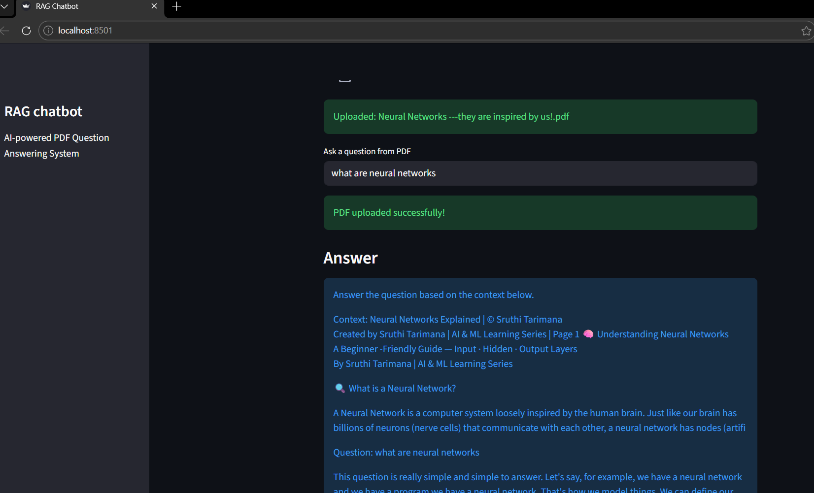
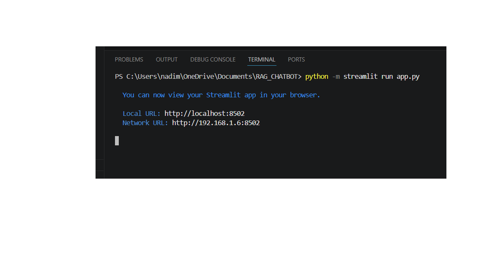
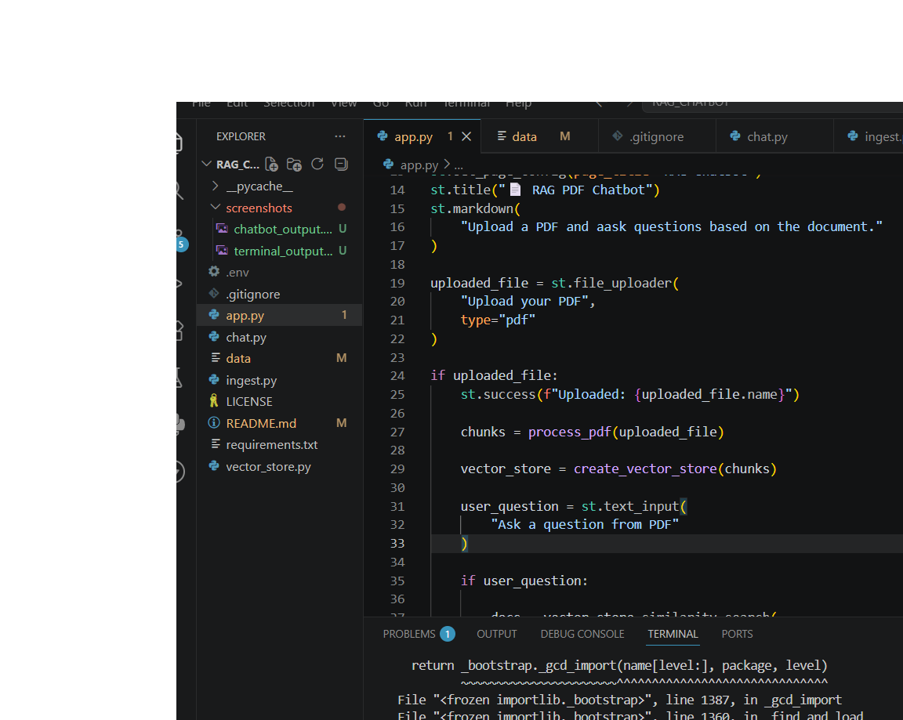

<<<<<<< HEAD
# RAG Chatbot Project

## Overview
This project is a Retrieval-Augmented Generation (RAG) chatbot developed using Streamlit, FAISS, HuggingFace embeddings, and Transformers. The chatbot allows users to upload PDF documents and ask questions based on the uploaded content.

## Features
- Upload PDF documents
- Extract text from PDFs
- Split text into chunks
- Store embeddings using FAISS
- Retrieve relevant content
- Generate answers using AI model
- Interactive Streamlit interface

## Technologies Used
- Python
- Streamlit
- LangChain
- FAISS
- HuggingFace Embeddings
- Transformers
- PyPDF2

## How to Run

Install required packages:

```bash
python -m pip install -r requirements.txt
=======
# RAG_CHATBOT
RAG-based PDF Chatbot using Streamlit, FAISS, HuggingFace Embeddings, and Transformers
>>>>>>> 43cbbc0b186ae61ba2fb237925f8a70c5cbde64d

## Screenshots

### Chatbot Interface


### Terminal Execution


### Code Implementation
